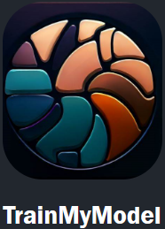

<p align="center">
  
</p>

# Train My Model
TrainMyModel is a web app to train a CNN (Convolution Neural Network) deep learning model to clasify between different classes.  
The user defines classes, and add the images to the dataset.  
Using Resnet-v2 as a base model, the model is refined on the user's classes and after the training, can classify new samples!

The app is built using Streamlit and FastAPI in Docker.  

## Installation
1. Clone the repository to your local machine.
```bash
git clone https://github.com/EASS-HIT-PART-A-2022-CLASS-III/TrainMyModel.git
```
2. Make sure Docker is running.
```bash
docker --version
```
3. Run from the directory 
```bash
cd TrainMyModel
docker-compose up
```
4. Go to [`localhost:8000`](http://localhost:8000), and have fun 😊.

## Usage
1. Navigate to the Homepage on [`localhost:8000`](http://localhost:8000).
2. Define your classes and upload images for each class.
3. Choose training parameters and train the model.
4. Predict class of a new image.

### Requirements
- Docker
- Python 3.9+

## Project Structure

```bash
├── backend
│   ├── __init__.py
│   ├── .env
│   ├── Dockerfile
│   ├── main.py
│   ├── README.md
│   ├── requirements.txt
│   ├── schemas.py
│   ├── unit_tests.py
├── frontend
│   ├── pages
│   │   ├── 1_My_Classes.py
│   │   ├── 2_Train_My_Model.py
│   │   ├── 3_My_Model.py
│   │   ├── 4_Predict.py
│   ├── res
│   │   ├── logo.png
│   │   ├── sidebar-logo.png
│   ├── __init__.py
│   ├── Dockerfile
│   ├── Homepage.py
│   ├── requirements.txt
├── mymodel
│   ├── __init__.py
│   ├── .env
│   ├── Dockerfile
│   ├── main.py
│   ├── model.py
│   ├── README.md
│   ├── requirements.txt
│   ├── services.py
├── res
│   ├── logo.png
├── .gitignore
├── docker-compose.yml
├── README.md
```

