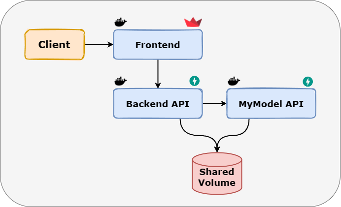

<p align="center">
  
</p>

# Train My Model

TrainMyModel is a web app to train a CNN (Convolution Neural Network) deep learning model to clasify between different classes.  
The user defines classes, and add the images to the dataset.  
Using Resnet-v2 as a base model, the model is refined on the user's classes and after the training, can classify new unseen samples!

The app is built using Streamlit and FastAPI in Docker.  

## Installation
1. Clone the repository to your local machine.
```bash
git clone https://github.com/EASS-HIT-PART-A-2022-CLASS-III/TrainMyModel.git
```
2. Make sure Docker is running.
```bash
docker --version
```
3. Run from the directory 
```bash
cd TrainMyModel
docker-compose up
```
4. Go to [localhost:8000](http://localhost:8000), and have fun 😊.

## Usage
1. Navigate to the Homepage on [localhost:8000](http://localhost:8000).
2. Define your classes and upload images for each class.
3. Choose training parameters and train the model.
4. Once the training is done, you can upload new images and classify them using the model or download the model for later use.

### Requirements
- Docker
- Python 3.9+

## Project Architecture

<p align="center">
  
</p>

## License

**MIT License**

Copyright ©️ 2023, Matan Mizrachi  
  
Permission is hereby granted, free of charge, to any person obtaining a copy 
of this software and associated documentation files (the "Software"), to deal 
in the Software without restriction, including without limitation the rights 
to use, copy, modify, merge, publish, distribute, sublicense, and/or sell 
copies of the Software, and to permit persons to whom the Software is 
furnished to do so, subject to the following conditions:  
  
The above copyright notice and this permission notice shall be included in all copies or substantial portions of the Software.  
  
THE SOFTWARE IS PROVIDED "AS IS", WITHOUT WARRANTY OF ANY KIND, EXPRESS OR 
IMPLIED, INCLUDING BUT NOT LIMITED TO THE WARRANTIES OF MERCHANTABILITY, 
FITNESS FOR A PARTICULAR PURPOSE AND NONINFRINGEMENT. IN NO EVENT SHALL THE 
AUTHORS OR COPYRIGHT HOLDERS BE LIABLE FOR ANY CLAIM, DAMAGES OR OTHER 
LIABILITY, WHETHER IN AN ACTION OF CONTRACT, TORT OR OTHERWISE, ARISING FROM, 
OUT OF OR IN CONNECTION WITH THE SOFTWARE OR THE USE OR OTHER DEALINGS IN THE 
SOFTWARE.  
